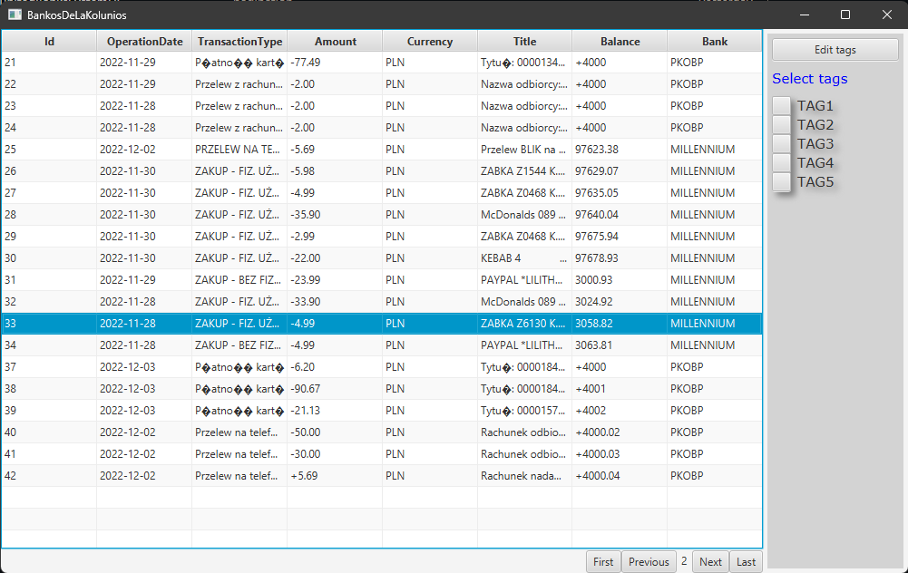

# UnitedBanks

### Technologie:  
    - Back-end: Spring
    - Front-end: JavaFX
    - Baza danych: H2

### OPIS:
Aplikacja ma na celu zebranie wyciagów z różnych banków w jednym miejscu, aby ułatwić nam przeglądanie i zarządzanie naszymi środkami.  

Nasz system obserwuje storage, czyli folder do którego możemy wrzucać wyciągi z różnych banków w postaci plików '.csv', lecz nie jest to jedyny sposób, alternatywnie mozemy wrzucać dane z zewnątrz poprzez post request na odpowiedni endpoint.   

Po dodaniu pliku z odpowiednim przedimkiem, nasz system indetyfikuje bank z którego pochodzi plik i wyciagnie z niego najważniejsze dla nas informacje,
wspólne dla wszytkich banków (obecnie obsługujemy historie transakacji z dwóch banków: Millennium oraz PKOBP, ale jest to w łatwy sposób rozszeżalne).  

W celu zapobiegnięcia przeciążenia naszego frontendu zbyt dużą ilością transakcji zaimplementowana jest paginacja czyli stronnicowanie danych.   

Wymiana danych w API realizowana jest za pomocą Retrofit. Proste UI wyświetla tabelę z rekordami transakcji ze wszystkich banków z możliwością tagowania poszczegolnych rekordów oraz filtrowania ich po danych tagach.     

### Widok:

